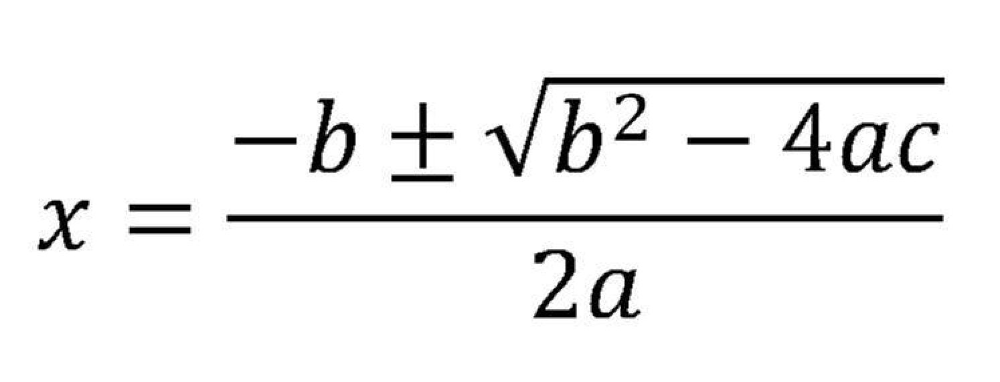

# COMP122 Lecture Notes: September 3, 2024

## Announcements:
   1. No class on Monday September 2, 2024

## Today's Agenda:
   1. Review / Questions
      - List of CLI Commands
   1. Git (for MW1130)
   1. SSH
   1. Install MIPS syntax package into sublime
   1. MD Assignment Walk Through
   1. PEMDAS and Three Address Code (next time?)
   1. Programming Assignment Overview (next time?)


## Questions from Last Lecture/Lab, etc.:
   * M/W @ 10:00 am

   * T/R @ 10:00 am


---
# Today's  Material

   1. List of CLI commands
      ```bash
      cd
      chsh
      cp; mv    # cp A /tmp/
      echo
      git
      git add; git rm
      git clone
      git commit
      git config --global --list
      git config --list
      git log
      git push              # git fetch; git merge 
      git status
      git branch
      git checkout
      ls -l -t -a; ls -lta;  ls --color="always"
      mars
      mips_subroutine
      java_subroutine
      mkdir; rmdir; rm -r
      open                   # start
      pbcopy                 # clip
      pwd
      source
      ssh
      ssh-keygen
      subl
      touch; rm
      ```

      <!-- PROMPT_COMMAND='(( $? == 0 )) && echo success'  -->

   1. Git (for MW1130)
       - A version control system (VCS) that utilizes a repository
       - repository: a complete copy of an entire project _throughout_ its lifetime  
       - commit:  a specific point in time in the life of a repository

     - Command reference `open ../reference/git-cheatsheet.png` and Major Components
        - remote repository (origin/main) (upstream)
        - local repository 
        - staging/index
        - working directory

     - Additional Concepts: (Foreshadowing future stuff)
       - branch:  an offshoot of "official" evolutionary path of the repository
         - merge: a commit point where branch information is combined with another branch

   1. SSH
      - secure connection to a remote resources
      - Authentication
        - something that you know
        - something about you
        - something that you have
      - SSL: secure socket layer (deprecated)
      - TLS: transport layer security (also known as SSL)
      - PKI: public key infrastructure

   1. Name: My First MD Assignment
      1. Assignments.md excerpt
         - Status: Released, but not Assigned
         - Deliverable ID: 02-
         - Public_URL: https://github.com/COMP122/02-first-MD-assignment-public
         - Invitation URL: https://classroom.github.com/a/5mXbyUv_
         - Due Date: Sep 06 23:59 PDT

      1. Review of Structure of the Repository
      1. README.md
      1. md_assignment_workflow.md
      1. Review `make`
         - or maybe not
         - just pretend it's a button on the GUI you need to click, i.e., more later.


  1. Install MIPS syntax package into sublime
     - "Install Package Control"
        * cmd+shift+p  or Windows+shift+p or Ctrl+shift+p
        * Install Package Control
      - Install mips syntax
        * cmd+shift+p or Windows+shift+p
        * Package Control: Install Package 
        * mips-syntax
      - Associate Java Syntax with all .j files within Sublime Text
        * New File (%N)
        * Save as `equation.j`
        * Bottom-right-hand corner -- select desired syntax
          - Open all with current extension as...
          - Select 'java'

  1. PEMDAS and Three Address Code (TAC)
     1. Run the command:  `subl -n quad.j`

     1. Solve the following equation:  ``a^2*x + b*x + c = 0``

        

     1. Rewrite into a single linear equation: ``x = expression;``
        - use only the following operators: () * / + -
        - use the sqrt() function

     1. Rewrite into a series of linear equation
        - Each equation must be in TAC (Three Address Code)
        - That is to say, each equation must be in the one of the following forms:
          * variable = literal;
          * variable = variable;
          * variable = variable (op) variable;
          * variable = func(variable);

     * Requirements:
       - 'temp' variables are named: t1, t2, t3, ...
       - each 'temp' variable can be defined only once!

  1. Programming Assignment Overview
     - URL: https://classroom.github.com/a/DDeWVuqO
     - [Workflow cheatsheet](../reference/programming_workflow.md)

     - Review of Structure of the Repository
     - Review of the `countdown` Program
     - Review `make` and `sth`


  1. Participation Assignment (https://classroom.github.com/a/DDeWVuqO
     - README.md


---
## Resources
   * reference/git-cheatsheet.png
   * tidbits/git-notes.md
   * tidbits/tidbit-git-merge.md 
   * bin/java_subroutine: a tool used to perform unit testing on a "j" subroutine


---
<!-- This section is for student's to place their own notes. -->
<!-- This section will not be updated by the Professor.   -->

# Notes 


